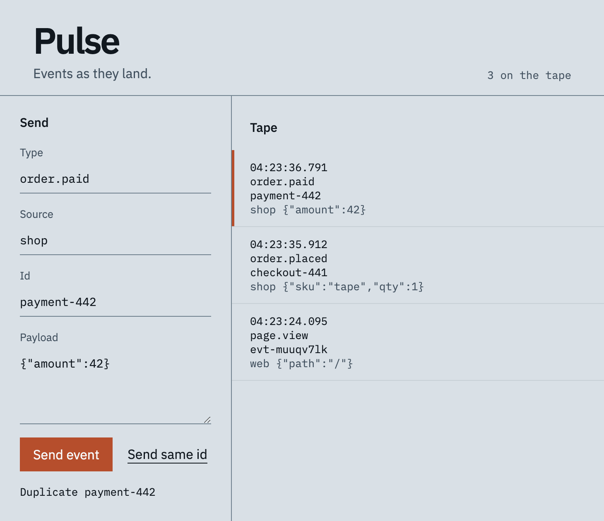
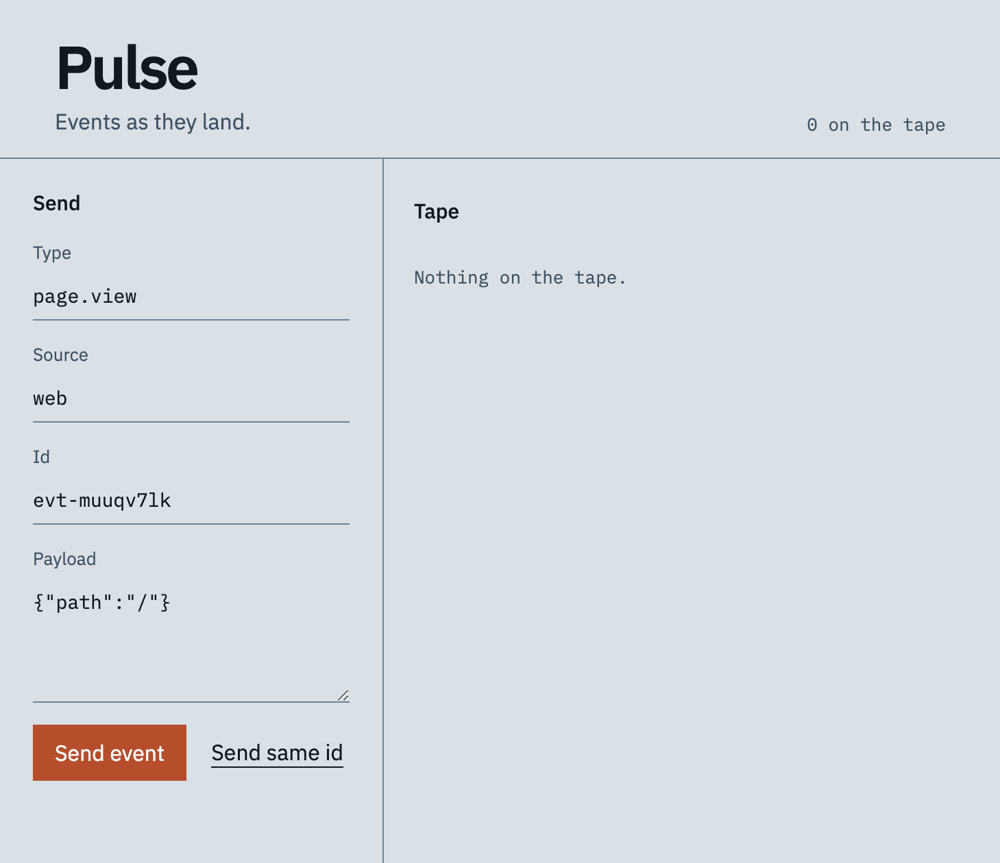

# Pulse



Real-time event streaming platform. A Gin ingest API dedups with Redis and publishes to Kafka. A consumer writes PostgreSQL and a hot-read cache. A gqlgen GraphQL edge reads through an internal gRPC query service. The console sends an event and shows it on the tape.




```
POST /v1/events  ->  Redis dedup  ->  Kafka  ->  processor  ->  Postgres + Redis
GraphQL /query   ->  gRPC QueryService  ->  Redis, then Postgres
```

## Console

Without Docker, one process serves the console, the ingest API, and the GraphQL edge:

```sh
go run ./cmd/demo
```

Open http://127.0.0.1:8088. Send an event, then send the same id to see the dedup response. The GraphQL playground is at `/playground`.

With the full stack, the same console is served by the GraphQL process on `:8081` and forwards sends to ingest.

## Run with Docker Compose

```sh
docker compose up --build
./scripts/smoke.sh
```

Ingest is on `:8080`, the GraphQL playground is on `:8081`, Grafana is on `:3000` (admin / `pulse`).

## Kubernetes

```sh
make images
kind load docker-image pulse-ingest:local pulse-processor:local pulse-query:local pulse-graphql:local
kubectl apply -k deploy
```

The manifests include Deployments, Services, a ConfigMap, a Secret, and HPAs for ingest and processor. CI renders them with `kubectl kustomize deploy`. HPAs need metrics-server in the cluster before they can scale. The CD workflow (`.github/workflows/cd.yml`) applies the same manifests when the `KUBECONFIG` secret is set. Load the images into that cluster first; this repo does not push them to a registry.

Kafka in the cluster is a single KRaft broker. Postgres and Kafka use `emptyDir`, so data does not survive a pod restart.

## Tests

```sh
go test ./...
```

The tests cover validation, dedup, the consumer commit rule, the gRPC read path, and the GraphQL edge. They do not start Kafka, Postgres, or Redis.
